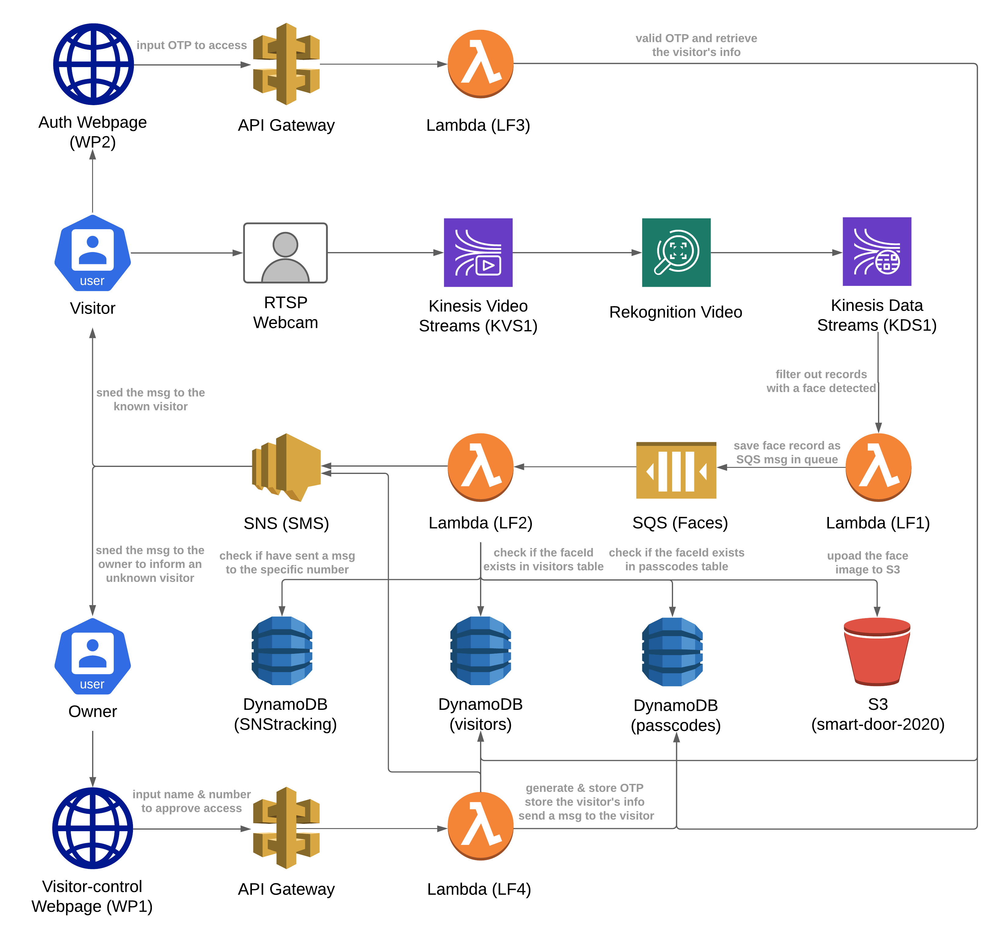

# Smart Door Authentication System

This project implements a Smart Door authentication system integrated with live streaming and face recognition by using AWS Kinesis Video Streams and Rekognition services. It simulates the out-door security camera workflow that authenticates/recognizes the visitor (face infomation) and provides her the access to a virtual door (or any sensitive resources) after the owner's permission.

## Workflow

||
|:--:|
|Application Architecture and Workflow|

Every time a visitor shows up in front of the camera, the system would be able to depict her face and determine if the visitor is known or not. 
- If the visitor is a known person, which means her face info already existed in the system, then she will receive an SMS message with a valid OTP passcode (expires in 5 minutes and can be only used once) and a web link that will lead her to the authentication webpage. Only when the visitor enters the right OTP before the expiration, then can she access the door (or the resource) and will receive a personalized greeting.
- If the visitor is an unknown person, which means her face info doesn't exist in the system, then the owener will receive an SMS message with a web link that will lead to the visitor-control webpage, where the visitor's face image captured earlier would display and the owner can reference that image for the permission consideration. If the owner decides to approve the access permission for that visitor, then the owner should input & submit the visitor's name and phone number. After that, the system will send a personalized SMS message to the visitor using the given phone number. The message shares the same format as for the known visitor which includes the OTP passcode and the link to the same authentication webpage. Then, the visitor would finish the authentication work there and access the door (or the resource).

## Implementation Details

### Visitor Vault
1. Create a S3 bucket (​`smart-door-2020​`) to store the photos of the visitors.
2. Create a DynamoDB table `"passcodes"` (​DB1​) that stores temporary
access codes to the virtual door and a reference to the visitor it was assigned to.
    - Use the TTL festure of DynamoDB to expire the records after 5 mintues.
    - Use the extra column `used` to track if the OTP has been used.
    - The table records should apply the following schema:
        ```python
        {
            "passcode": otp,
            "faceId": faceId,
            "ttl": int(time.time() + 5 * 60),
            "used": False
        }
        ```
3. Create a DynamoDB table `"visitors"` (​DB2​) that stores details info about the visitors that the Smart Door system is interacting with.
    - Index each visitor by the faceId detected by Rekognition, alongside the name of the visitor and her phone number. When storing a new face, if the faceId returned by Rekognition already exists in the database, append the new photo to the existing photos array.
    - The table records should apply the following schema:
        ```python
        {
            "faceId": "a1b2c3d4e5",  # faceId returned by Rekognition
            "name" : "Jim",
            "phoneNumber": "+16666664444",  # should include the country code
            "phtots": [
                {
                    "objectKey": "kvs1_20201231-115959.jpeg",  
                    # follow the naming pattern as 'kvs1_YYYYmmdd-HHMMSS' (using time.strftime(%Y%m%d-%H%M%S)),
                    "bucket": "smart-door-2020",
                    "createdTimestamp": "2020-12-31T11:59:59"  
                    # follow the naming pattern as 'YYYY-mm-ddTHH:MM:SS' (using time.strftime("%Y-%m-%dT%H:%M:%S"))
                }
            ]
        }
        ``` 

### Analysis
1. Create a Kinesis Video Stream (​KVS1​), that will be used to capture and
stream video for analysis.
    - Download the KVS Producer SDK GStreamer plugin. Recommend using the Docker image to deploy it locally with the code below:
        ```
        # Docker registry:
        aws ecr get-login-password --region us-west-2 | docker login --password-stdin --username AWS 546150905175.dkr.ecr.us-west-2.amazonaws.com

        # Check the registry:
        cat ~/.docker/config.json

        # Docker image pull:
        aws ecr get-login --no-include-email --region us-west-2 --registry-ids 546150905175 | sudo docker pull 546150905175.dkr.ecr.us-west-2.amazonaws.com/kinesis-video-producer-sdk-cpp-amazon-linux:latest

        # Docker run:
        docker run -it --network="host" 546150905175.dkr.ecr.us-west-2.amazonaws.com/kinesis-video-producer-sdk-cpp-amazon-linux /bin/bash
        ```
    - Get an IP camera or simulate one on the iPhone or iPad to create an RTSP video stream. Recommend using the [IP Camera Lite](https://apps.apple.com/us/app/ip-camera-lite/id1013455241) APP on iOS. Better to delete the User name and Password in the Settings.
    - Run the following GStreamer commands to stream the RSTP source to Kinesis Video Streams.
        ```
        gst-launch-1.0 rtspsrc location=rtsp://192.168.1.***:****/live short-header=TRUE ! rtph264depay ! video/x-h264, format=avc,alignment=au ! h264parse ! kvssink stream-name=KVS1 storage-size=512  access-key="ACCESS_KEY" secret-key="SECRET_KEY" aws-region="REGION"
        ```
2. Subscribe Rekognition Video to the Kinesis Video Stream (​KVS1​) and output the Rekognition Video analysis to a Kinesis Data Stream (​KDS1​)
    - Create a face collection in Rekognition:
        ```
        aws rekognition create-collection --collection-id FaceCollection --region us-east-1
        ```
    - Create a stream processor that bridges KVS1 and KDS1 over Rekognition:
        ```
        aws rekognition create-stream-processor --region [Your-Region] --cli-input-json file://[Path-To-JSON-File-You-Created-Below]
        ```
    - The JOSN configuration file for the stream processor above:
        ```json
        {
            "Name": "RekognitionBridge",
            "Input": {
                "KinesisVideoStream": {
                        "Arn": "arn:aws:kinesisvideo:us-east-1:YOUR-ACCOUNT-ID:stream/KVS1/NUMBER"
                }
            },
            "Output": {
                "KinesisDataStream": {
                        "Arn": "arn:aws:kinesis:us-east-1:YOUR-ACCOUNT-ID:stream/KDS1"
                }
            },
            "RoleArn": "arn:aws:iam::YOUR-ACCOUNT-ID:role/rekognition",
            "Settings": {
                "FaceSearch": {
                        "CollectionId": "FaceCollection",
                        "FaceMatchThreshold": 95.5
                }
            }
        }
        ```
    - Start the stream processor just created:
        ```
        aws rekognition start-stream-processor --name RekognitionBridge --region us-east-1
        ```
    - The records output from KDS1 trigger a Lambda function (`LF1`). In `LF1`, only the record with the face detected would send a message to an SQS queue (`Faces`) that includes the detailed face info.
    - The SQS queue `Faces` triggers another Lambda function (`LF2`). `LF2` would handle the following workflow regarding if the visitor is a known person or unknown.
        - For every known face detected by Rekognition, send an SMS message  to the visitor using the phone number recorded in the table `visitors`. The text message should include a 6-digit One-Time Passcode (OTP) that the visitor can use to open the virtual door (and store that OTP in the table `passcodes` giving 5 minutes expiration also with an extra column to track if the OTP has been used) and a web link for the authentication webpage (`WP2`). The authentication could be implemented with another Lambda function (`LF3`) and triggered by an API Gateway.
        - For every unknown face detected by Rekogniton, send an SMS to the owner that should include a web link to the visitor-control webpage (`WP1`) to approve the access for the visitor.
            - In the visiotr-control webpage, the visitor's face image captured earlier would display and the owner can reference that image for the permission consideration. If the owner decides to approve the access permission for that visitor, then the owner should input & submit the visitor's name and phone number via a web form.
            - Submitting this form should create a new record in the `visitors` table (​DB2​), indexed by the faceId identified by Rekognition. This workflow could be implemented with another Lambda function (`LF4`) and triggered by an API Gateway.
            - Meanwhile, `LF4` would also generate a OTP for the vistor and store it in the `passcodes` table (​DB1​), with a 5 minute expiration timestamp and an extra column to track if the OTP has been used.
            - `LF4` also triggers the SNS service to send an SMS message to the visitor using the given phone number. The message shares the same format as for the known visitor which includes the OTP passcode and the link to the same authentication webpage.

### Authentication
1. For the authentication webpage (`WP2`) link sent to the visitor, a `faceId` parameter associated with this visitor would be included in the url.
2. Only the faceId matches the input OTP within the 5 minutes expiration timeslot and **it's the first time authentication using that OTP for this visitor**, then can the visitor access the virtual door. And the webpage would present a personalized greeting message for the visitor.
3. If the visitor already used the received OTP to access the door once, then within 5 mintues, whenever she tries to reuse that OTP to unlock, it would fail (since that passcode has already been used). The webpage would present the relevant failure message and lead the visitor to request a new OTP.
4. Input expired OTP or invalid OTP (not a 6-digit number), the webpage would present the relevant failure message.

### Tricky Parts
1. How to handle hight throughput records generated by Rekognition?
    - Since Rekognition is a real-time analysis system, which means multiple records would be sent to the `KDS1` at the same time. To handle that sort of high throughput data, I implement the `LF1` to filter out the records only with a face detected and send those face records to the SQS queue `Faces`. Also, to better decrease the throughput, I confirgure the `LF1`'s trigger as follows:
    
    - Whenever the SQS queue `Faces` receives a message from the `LF1`, it will trigger the `LF2` to analyze the face records. To avoid bothering the owner or the visitor with plently of messages in a short period, I create another DynamoDB table `"SNStracking"` to track the message sent to the specific phone number with a TTL (timestamp) set to 60 seconds.     
        - Whenever a not-matched face detected, the `LF2` will check if there is any message sent to the owner in the past 60s. If not, then the function will upload the unknown visitor's image and send the request message to the owner. If there is already a message sent to the owner in the past minute, then just ignore it. 
        - Whenever a matched face detected, the `LF2` will also check if there is any message sent to the visitor in the past 60s.
        - Meanwhile, to avoid uploading multiple images for the known visitor in the short period, `LF2` will first check if the `faceId` associated with that visitor exists in the `passcodes` table and within 5 mintues expiration slot. If not, then the function will generate a new OTP for that visitor and upload the face image to S3 bucket and send out the message.

2. How to capture the face image from the video stream?
    - Any record with the face detected has an associated `ProducerTimestamp` stored in the `data['InputInformation']['KinesisVideo']['ProducerTimestamp']` to indicate the start timestamp for the fragment in the video stream.
    - Get the video stream endpoint using the function `get_data_endpoint` in the boto3 client service `kinesisvideo`.
    - Get the HLS Streaming Session URL using the function `get_hls_streaming_session_url` in the boto3 client service `kinesis-video-archived-media` with the `StartTimestamp` as the `ProducerTimestamp`.
    - Then, capture the frame from the URL above using cv2.

3. How to import OpenCV library in Lambda with Layers:
    - Found this [tutorial](https://www.thetechnologyupdates.com/opencv-with-aws-lambda-via-layers/) really helpful. Just follow it!
